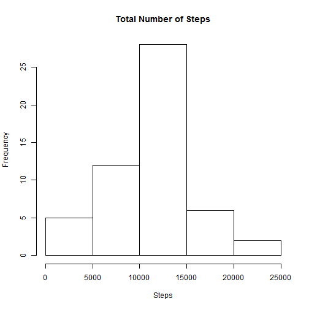
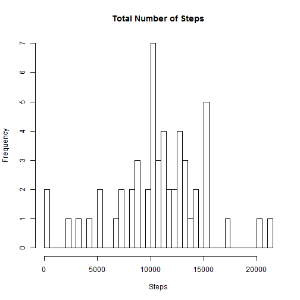
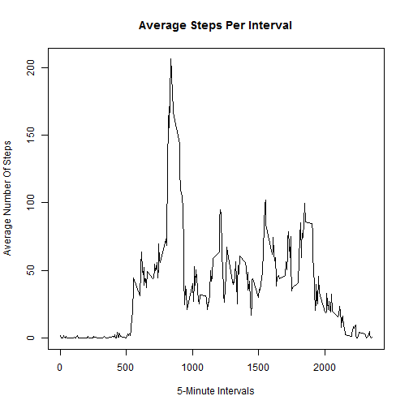
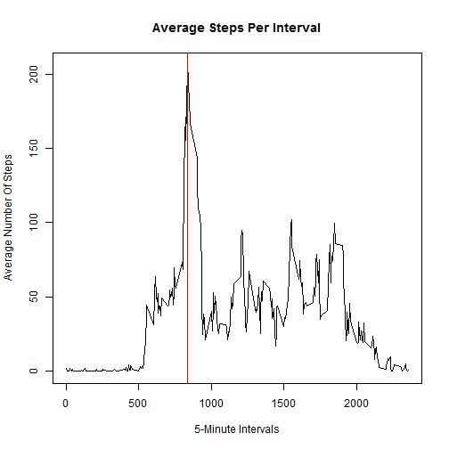
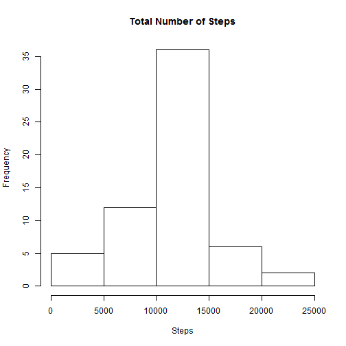
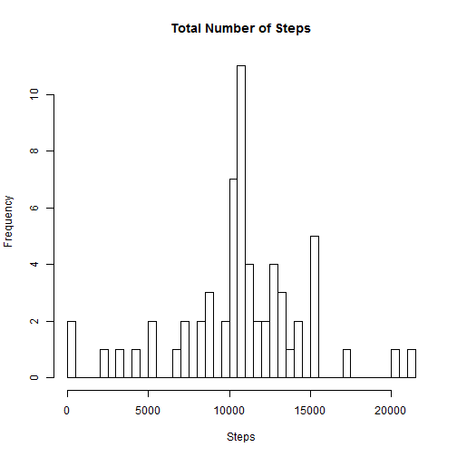
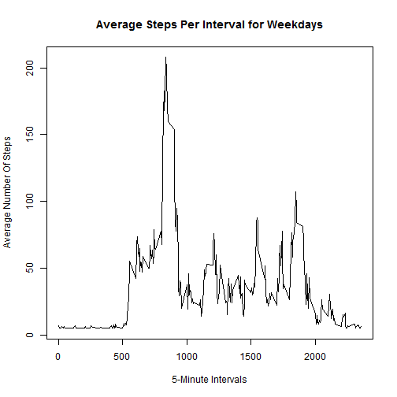
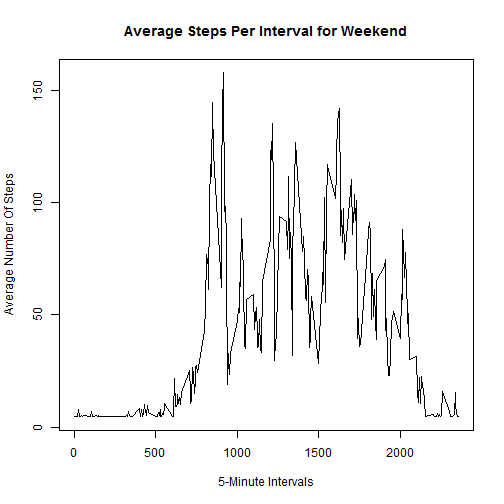

# Reproducible Research: Peer Assessment 1


## Loading and preprocessing the data

TASK: Load the data  and if necessary process/transform the data into a format suitable for analysis

* Data set is already downloaded and unziped - activity.csv.
* The variables included in this dataset are:
    - steps: Number of steps taking in a 5-minute interval (missing values are coded as NA)
    - date: The date on which the measurement was taken in YYYY-MM-DD format
    - interval: Identifier for the 5-minute interval in which measurement was taken
* The dataset is stored in a comma-separated-value (CSV) file and there are a total of 17,568 observations in this dataset.
* Load the data using read.csv()


```r
activity <- read.csv("activity.csv", header = TRUE, stringsAsFactors = FALSE)
```

* Convert column date into Date type using as.Date()

```r
activity$date <- as.Date(activity$date, format="%Y-%m-%d")
```

* Summary

```r
summary(activity)
```

```
##      steps            date               interval   
##  Min.   :  0.0   Min.   :2012-10-01   Min.   :   0  
##  1st Qu.:  0.0   1st Qu.:2012-10-16   1st Qu.: 589  
##  Median :  0.0   Median :2012-10-31   Median :1178  
##  Mean   : 37.4   Mean   :2012-10-31   Mean   :1178  
##  3rd Qu.: 12.0   3rd Qu.:2012-11-15   3rd Qu.:1766  
##  Max.   :806.0   Max.   :2012-11-30   Max.   :2355  
##  NA's   :2304
```

```r
str(activity)
```

```
## 'data.frame':	17568 obs. of  3 variables:
##  $ steps   : int  NA NA NA NA NA NA NA NA NA NA ...
##  $ date    : Date, format: "2012-10-01" "2012-10-01" ...
##  $ interval: int  0 5 10 15 20 25 30 35 40 45 ...
```

## What is mean total number of steps taken per day?

TASK:

1. Make a histogram of the total number of steps taken each day

* First, we ignore missing value, and then calculate total steps per day


```r
newdata <- na.omit(activity)
totalSteps <- aggregate(newdata$steps, by=list(newdata$date), FUN=sum)
colnames(totalSteps) <- c("date", "steps")
```

* Plotting a histogram

```r
hist(totalSteps$steps, main="Total Number of Steps", xlab="Steps")
```

 

* Histogram where the numbers of cells is 

```r
hist(totalSteps$steps, breaks = length(totalSteps$steps), main="Total Number of Steps", xlab="Steps")
```

 

2. Calculate and report the mean and median total number of steps taken per day
    - mean
    - median

```r
mean(totalSteps$steps)
```

```
## [1] 10766
```
    

```r
median(totalSteps$steps)
```

```
## [1] 10765
```

## What is the average daily activity pattern?

TASK:

    1. Make a time series plot (i.e. type = "l") of the 5-minute interval (x-axis) and the average number of steps taken, averaged across all days (y-axis)

- Calculate average steps by day


```r
avgSteps <- aggregate(newdata$steps, by = list(newdata$interval), FUN = mean)
colnames(avgSteps) <- c("interval", "steps")
```

- Time series plot 

```r
plot(avgSteps$interval, avgSteps$steps, type="l", main="Average Steps Per Interval", xlab="5-Minute Intervals", ylab="Average Number Of Steps")
```

 
    
        
    2. Which 5-minute interval, on average across all the days in the dataset, contains the maximum number of steps?

- Calculate max average 

```r
maxavg <- avgSteps$interval[[which.max(avgSteps$steps)]]
maxavg
```

```
## [1] 835
```

- Show maxavg on the plot

```r
plot(avgSteps$interval, avgSteps$steps, type="l", main="Average Steps Per Interval", xlab="5-Minute Intervals", ylab="Average Number Of Steps")
abline(v = maxavg, col = "red")
```

 

## Imputing missing values

TASK:

    1. Calculate and report the total number of missing values in the dataset (i.e. the total number of rows 
with NAs) 

- Diference between number of rows of dataset 'activity' and number of rows of dataset 'activity' without missing value


```r
totalNa <- nrow(activity) - nrow(newdata)
totalNa
```

```
## [1] 2304
```

    2.Devise a strategy for filling in all of the missing values in the dataset. The strategy does not need to be sophisticated. For example, you could use the mean/median for that day, or the mean for that 5-minute interval, etc.


```r
allData <- activity
for (i in 1:nrow(allData)) {
    if (is.na(allData$steps[i]))
        allData$steps[i] <-  mean(activity$steps,na.rm = TRUE) 
}
```

    3.Create a new dataset that is equal to the original dataset but with the missing data filled in.
    

```r
noNaActivity <- allData
```
    
    4.Make a histogram of the total number of steps taken each day and Calculate and report the mean and median total number of steps taken per day. 
    
- Histogram of the total number of steps taken each day

```r
noNaTotalSteps <- aggregate(noNaActivity$steps, by=list(noNaActivity$date), FUN=sum)
colnames(noNaTotalSteps) <- c("date", "steps")

hist(noNaTotalSteps$steps, main="Total Number of Steps", xlab="Steps")
```

 

- Histogram of the total number of steps taken each day with a number of cells

```r
hist(noNaTotalSteps$steps, breaks = length(noNaTotalSteps$steps), main="Total Number of Steps", xlab="Steps")
```

 
    
- Mean

```r
mean(noNaTotalSteps$steps)
```

```
## [1] 10766
```
    
- Median

```r
median(noNaTotalSteps$steps)
```

```
## [1] 10766
```


    5.Do these values differ from the estimates from the first part of the assignment? What is the impact of imputing missing data on the estimates of the total daily number of steps?
    

```r
summary(activity)
```

```
##      steps            date               interval   
##  Min.   :  0.0   Min.   :2012-10-01   Min.   :   0  
##  1st Qu.:  0.0   1st Qu.:2012-10-16   1st Qu.: 589  
##  Median :  0.0   Median :2012-10-31   Median :1178  
##  Mean   : 37.4   Mean   :2012-10-31   Mean   :1178  
##  3rd Qu.: 12.0   3rd Qu.:2012-11-15   3rd Qu.:1766  
##  Max.   :806.0   Max.   :2012-11-30   Max.   :2355  
##  NA's   :2304
```

```r
summary(noNaActivity)
```

```
##      steps            date               interval   
##  Min.   :  0.0   Min.   :2012-10-01   Min.   :   0  
##  1st Qu.:  0.0   1st Qu.:2012-10-16   1st Qu.: 589  
##  Median :  0.0   Median :2012-10-31   Median :1178  
##  Mean   : 37.4   Mean   :2012-10-31   Mean   :1178  
##  3rd Qu.: 37.4   3rd Qu.:2012-11-15   3rd Qu.:1766  
##  Max.   :806.0   Max.   :2012-11-30   Max.   :2355
```

```r
mean(totalSteps$steps) - mean(noNaTotalSteps$steps)
```

```
## [1] 0
```

```r
median(totalSteps$steps) - median(noNaTotalSteps$steps)
```

```
## [1] -1.189
```


## Are there differences in activity patterns between weekdays and weekends?

TASK:

    1.Create a new factor variable in the dataset with two levels - "weekday" and "weekend" indicating whether a given date is a weekday or weekend day.
 

```r
dayName <- weekdays(noNaActivity$date)

for (i in 1:length(dayName)) {
    if (dayName[i] == "Saturday" | dayName[i] == "Sunday"){
        dayName[i] <- "weekend"
    }
    else {
        dayName[i] <- "weekday"
    }
}

noNaActivity <- cbind(noNaActivity, dayName)
```
    
    2. Make a panel plot containing a time series plot (i.e. type = "l") of the 5-minute interval (x-axis) and the average number of steps taken, averaged across all weekday days or weekend days (y-axis).
    

```r
dataWeekday <- subset(noNaActivity, dayName == "weekday")
dayData <- aggregate(dataWeekday$steps, by = list(dataWeekday$interval), FUN = mean)
colnames(dayData) <- c("interval", "steps")

dataWeekend <- subset(noNaActivity, dayName == "weekend")
weekendData <- aggregate(dataWeekend$steps, by = list(dataWeekend$interval), FUN = mean)
colnames(weekendData) <- c("interval", "steps")

plot(dayData$interval, dayData$steps, type="l", main="Average Steps Per Interval for Weekdays", xlab="5-Minute Intervals", ylab="Average Number Of Steps")
```

 

```r
plot(weekendData$interval, weekendData$steps, type="l", main="Average Steps Per Interval for Weekend", xlab="5-Minute Intervals", ylab="Average Number Of Steps")
```

 

